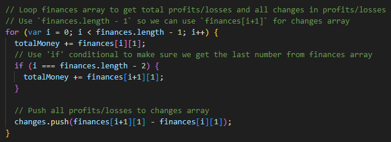

# Console Finances

## Description

This is the fourth challenge in the Front-End Skills Bootcamp.

This is a JavaScript challenge, in which, I have been given an array of finances which contains two fields, one displays the date and the other displays profits/losses.

I have been tasked with writing a JavaScript program which analyzes the given array to calculate and display data that the company might find useful, such as, the number of months in the dataset and the total profits/losses.

The first thing I chose to do was to declare all the variables that would be of use in the program. I have a section for all the variables I will use to display data to the user, and another section for variables that I will use to help me retrieve that data; as seen in the image below.

Next, the bulk of the program. Here I used multiple JavaScript functions, including `.push()` and `Math.` functions, as well as some `for` loops and conditionals. 

The snippet below shows how I used a single `for` loop to get both the total profits/losses and the changes in profits/losses from the finances array.

I made sure to heavily comment my code so that it is accessible to any new users who may wish to edit or understand the functionality of the code. I also tried to optimize the code by using the least amount of `for` loops that I could and making the most of some of JavaScripts built-in functions.

This task taught me about the importance of commenting your code and laying it out in a coherent way, so that you can understand your code when you come back to it and others are able to quickly understand what each part does.

## Installation

N/A

## Usage

The program can be accessed via this link: https://satsumasegment.github.io/console-finances/

To view the output, right-click -> select "Inspect" or "Inspect Element"-> click the 'console' tab. (See images below)

## License

N/A